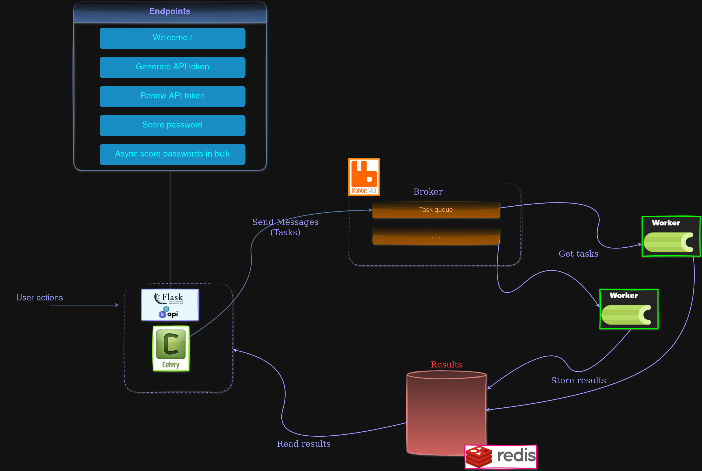

# ws-password-scoring API

    Simple web service to validate a password according to rules and strength.
    The default rules for a password are:
        - contains at least 1 digit
        - contains at least 1 uppercase character
        - contains at least 1 special character
        - contains at least 1 lowercase character
        - has a maximum length of 40 characters
        - has a minumum length of 10 characters
        - should return a minimum result score default value of 62

## Scoring password endpoints:
    /password-scoring/api/v1.0/score

## Commands to run development flask server
    define the env variable FLASK_APP:
    FLASK_ENV="local.dev"
    $env:FLASK_APP=app.py
    $ flask run
    $ python -m flask run

    change the default port: 
    define the env variable FLASK_RUN_PORT
    $flask run --port 2415

    accept requests from any computer:
    $ flask run --host 0.0.0.0
    $ flask --app app run --port 6119 --host 0.0.0.0   

    executer les migrations pour les actions sur la BDD:
    flask --app app db init
    flask --app app db migrate -m "migration initiale"
    flask --app app db upgrade

## Launch the tests suite
    python -m unittest .\tests\test_scoring_password.py

## Build a docker image:
    maintenance-scripts/docker-images/create/004-build-docker-image.ps1

## Start and stop docker image:
    maintenance-scripts/docker-images/start-containers/005-start-service-password-scoring.ps1
    maintenance-scripts/docker-images/stop-containers/006-stop-service-password-scoring.ps1

## Start the project in local dev
    1. Start the minio server
    2. Launch the flask local dev app

## Documentation Swagger and Open API 
    
    Generate the documentation:
    flask openapi write --format¡yaml openapi.yaml

    The flask app needs the following envs:
    API_TITLE="Library API"
    API_VERSION="v1.0.0"
    OPENAPI_VERSION="3.1.0"
    OPENAPI_DESCRIPTION="A password scoring API"

    Access the documentation:
    http://127.0.0.1:

- https://pypi.org/project/flask-smorest/ 
- https://speakeasy.com/openapi/frameworks/flask 
- https://pypi.org/project/flask-openapi3/ 
- https://diptochakrabarty.medium.com/flask-python-swagger-for-rest-apis-6efdf0100bd7
